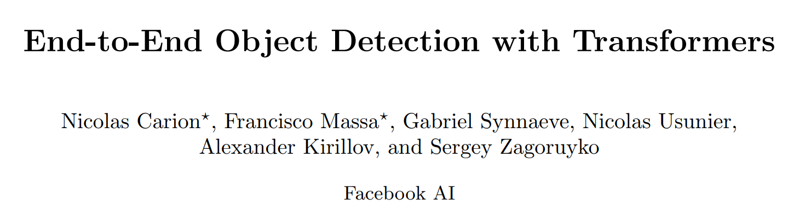
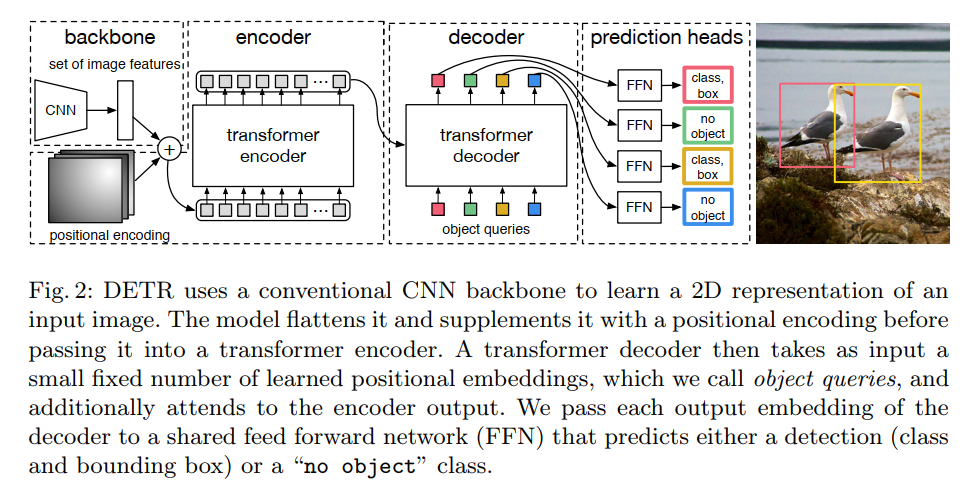

# End-to-End Object Detection with Transformers

github: https://github.com/facebookresearch/detr

# 摘要

本文将目标检测问题视作是直接集合预测的问题。创新性在于本文采用的方法能够移除了NMS或像anchor生成等需要任务中的目标的先验知识的步骤。本文通过引入DEtection TRansformer（DETR）这一主要模块实现前面提到的创新。这一检测框架特点有二：一是其是一个带transformer的encoder-decoder结构的网络，二是其损失是基于集合的全局损失，而损失使用GT和预测的集合进行最优双边匹配得到的。当给定一个从物体中学习到的固定的小集合队列（一般通过CNN得到），DETR能够找到物体和全局画面内容的联系，并直接输出最终预测结果。其和很好地调教过的Faster R-CNN的实时性能和准确性能类似，同时DETR在全景分割中也有一战之力。

# 主要创新点
- 1 双边匹配损失的设计。
- 2 transformer引入（并行解码），与之前使用RNN进行解码的方案不同。

# DETR

在直接使用集合预测进行目标检测过程中，有两个部分是至关重要的：
- 1 集合预测损失，其强迫预测结果和真实结果实现一一对应的匹配。
- 2 一个能够预测目标的集合及目标间关系的框架设计。

## 检测目标集合预测损失

双边匹配问题的匈牙利方法：
http://www.hungarianalgorithm.com/examplehungarianalgorithm.php

## 框架设计

